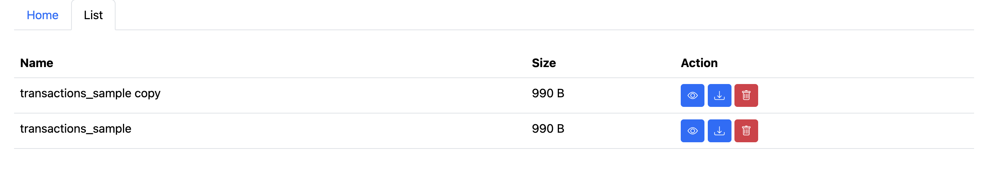

# PHP and Docker Expense Tracker

This is a simple web application built with PHP and Docker to practice these technologies. The purpose of this app is to provide an easy way to upload, view, and manage `.csv` files containing financial data. It processes the uploaded file, displays the content in a well-designed table, and calculates key financial metrics.

## Features


- **Upload CSV Files**: Upload a `.csv` file containing your financial data.
- **Display Data**: View the contents of the uploaded `.csv` file in a clean and user-friendly table.
- **Calculate Metrics**:
  - Total Income
  - Total Expenses
  - Net Balance
- **Manage Files**:
  - View a list of all uploaded `.csv` files.
  - Delete uploaded files.
  - Download uploaded files.

## CSV File Format

The application expects the following columns in the `.csv` file:

- `Date` - The date of the transaction.
- `Check #` - A reference number for the transaction.
- `Description` - A brief description of the transaction.
- `Amount` - The monetary amount of the transaction.

> **Note**: Ensure your `.csv` file follows this format for proper functionality.     
> **Note**: There is example `.csv` inside `public/transactions_sample.csv`.

## Requirements

- **Docker**: Used to containerize the application.
- **PHP**: The core technology powering the application.

### Clone the Repository

```bash
git clone https://github.com/yourusername/expense-tracker.git
cd expense-tracker
```

### Start the Application

1. Make sure you have Docker installed on your system.
2. You should go to `docker` directory
```bash
  cd docker
```  
3. Build and start the Docker containers:
```bash
docker-compose up -d
```
4. Open your browser and navigate to http://localhost:8000 to access the application.

### Screenshots

#### Home Page


#### List Page


#### Table


### Feature Improvements

- Add support for different currencies.
- Enhance error handling for invalid CSV files.
- Implement authentication for file management.